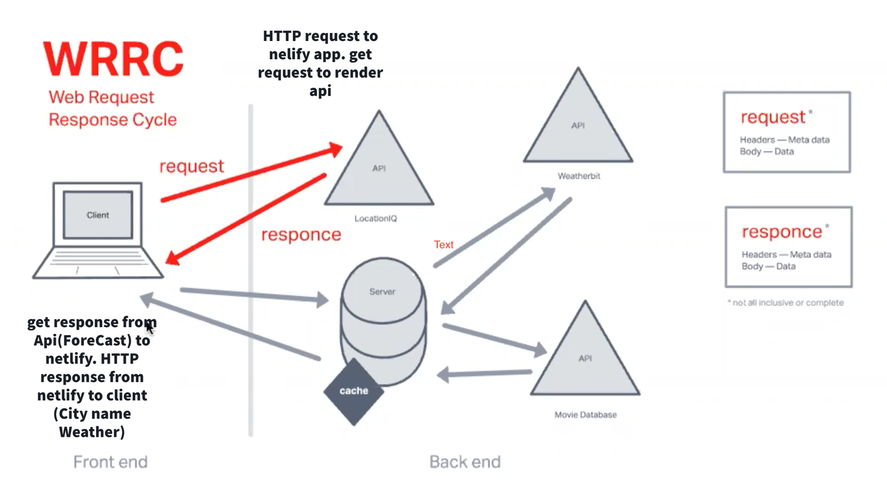

# City Explorer Api

## Todd Wolden

## Overview

## Getting Started

## Architecture

## Change log

## Credit and Collaborations

Worked with Keyan on the wrrc

Name of feature: Asynchronous code, and APIs

Estimate of time needed to complete: 5 hours

Start time: 3pm

Finish time: 9pm

Actual time needed to complete: 6

Name of feature: Custom Servers with Node and Express

Estimate of time needed to complete: 5 hours

Start time:  6pm

Finish time: 12pm

Actual time needed to complete: 6 hours

